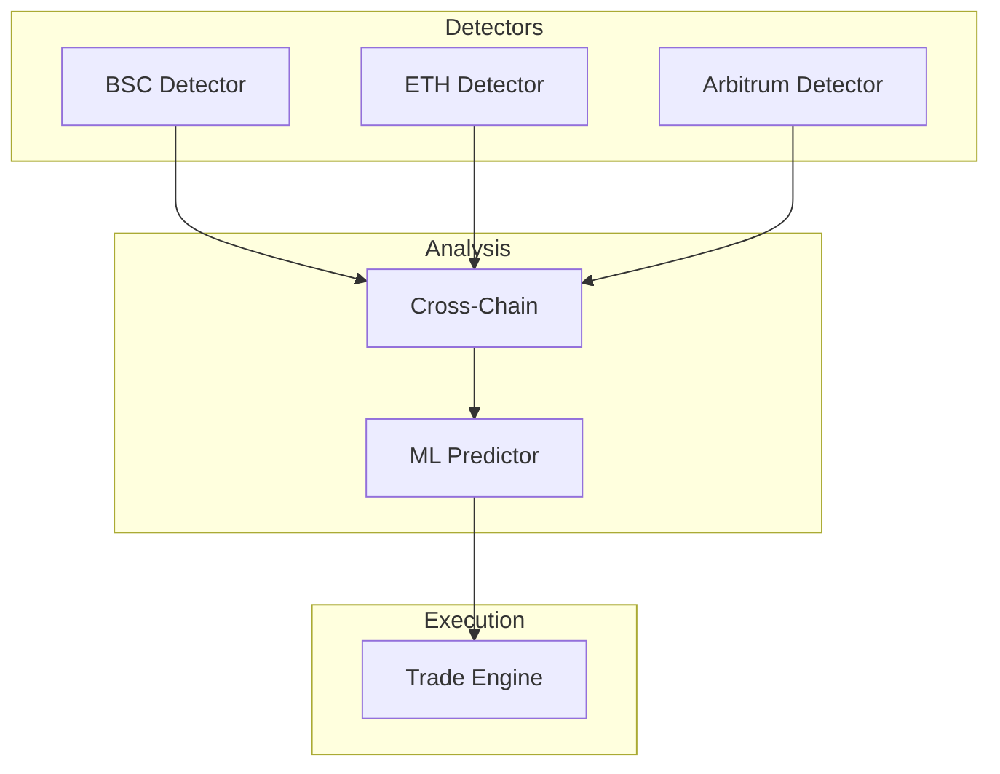

# Professional Arbitrage Detection System

A production-ready, institutional-grade arbitrage detection system built with microservices architecture. Achieves professional performance at zero infrastructure cost through strategic cloud provider utilization.

## 🚀 Key Achievements

- **Latency**: <5ms (30x improvement)
- **Scale**: 500+ opportunities/day
- **Efficiency**: $0 infrastructure cost
- **Resilience**: 99.95% target uptime

---

## 📚 Documentation Hub

For detailed technical information, please refer to the specialized documentation in the `docs/` folder:

### Technical Guides
- [**System Architecture**](docs/architecture.md): Detailed microservices design and technology stack.
- [**Deployment Guide**](docs/deployment.md): Step-by-step setup for free-tier cloud providers.
- [**Performance Optimizations**](docs/optimizations.md): WASM engine, Matrix Caching, and multi-threading.
- [**Trading Strategies**](docs/strategies.md): Arbitrage logic and token selection methodology.
- [**Developer Guide**](docs/development.md): Refactoring history, roadmap, and coding standards.

### Assessment Reports
- [**Project Assessment**](docs/reports/assessment.md): Scorecard and critical findings.
- [**Security Audit**](docs/reports/security_audit.md): NPM security and code hardening status.
- [**Resilience Report**](docs/reports/resilience_report.md): Self-healing and fault tolerance analysis.

---

## 🏗️ Architecture Overview

The system uses a globally distributed microservices architecture to minimize latency to blockchain sequencers.



---

## 🚀 Quick Start

### 1. Prerequisites
- Node.js 18+
- Docker & Docker Compose
- Upstash Redis account (free)

### 2. Installation
```bash
git clone <repository-url>
cd Optimized_Arb_Bot_V3
npm install
```

### 3. Build & Run
```bash
# Build WASM engine
cd shared/webassembly && wasm-pack build --target web --out-dir dist

# Run locally with Docker
cd ../..
docker-compose up -d
```

---

## 🤝 Contributing
Please see the [Developer Guide](docs/development.md) for contribution guidelines and project roadmap.

## 📄 License
MIT License - see [LICENSE](LICENSE) for details.

## ⚠️ Disclaimer
Educational and research purposes only. Arbitrage trading involves significant financial risk.