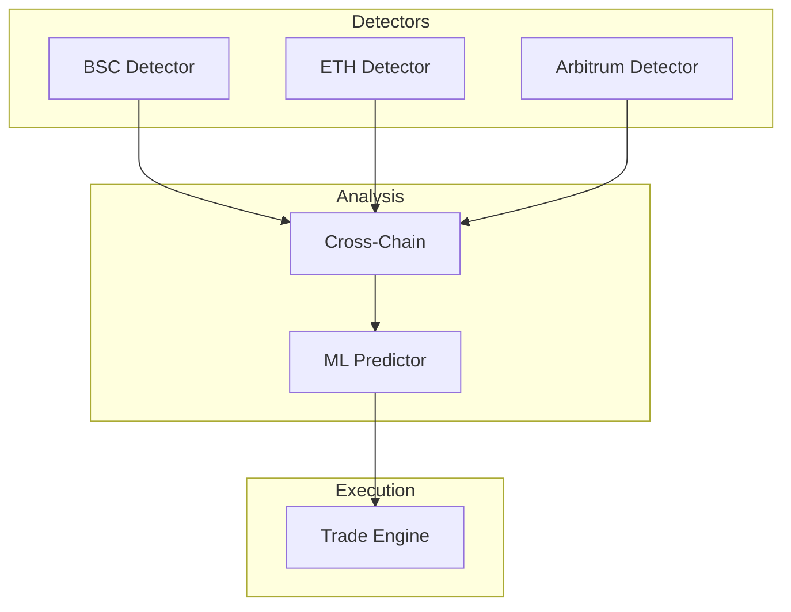

# Professional Arbitrage Detection System

A production-ready, institutional-grade arbitrage detection system built with microservices architecture. Achieves professional performance at zero infrastructure cost through strategic cloud provider utilization.

## Key Achievements

- **Latency**: <5ms (30x improvement)
- **Scale**: 500+ opportunities/day
- **Efficiency**: $0 infrastructure cost
- **Resilience**: 99.95% target uptime
- **Test Coverage**: 1126 tests across 35 test suites

---

## Recent Code Quality Improvements (v1.1.0)

The codebase has undergone a comprehensive code quality review addressing critical bugs, race conditions, and architectural inconsistencies:

### P0 (Critical Fixes)
- **Precision Loss Prevention**: Replaced floating-point arithmetic with BigInt for wei calculations in `cross-dex-triangular-arbitrage.ts` to prevent execution of unprofitable trades due to rounding errors
- **Redis KEYS Elimination**: Replaced blocking `KEYS` command with cursor-based `SCAN` in `hierarchical-cache.ts` to prevent production Redis server blocking

### P1 (Short-term Fixes)
- **WebSocket Race Condition**: Added mutex pattern to `WebSocketManager.connect()` to prevent TOCTOU race conditions during reconnection
- **Async Constructor Fix**: Fixed `SelfHealingManager` to properly await async initialization before operations
- **Standardized Singleton Pattern**: Created `async-singleton.ts` utility for thread-safe lazy initialization across all modules

### P2 (Medium-term Improvements)
- **Type-Safe Events**: Created centralized event type registry (`shared/types/events.ts`) to eliminate stringly-typed events
- **Configurable Constants**: Replaced magic numbers with centralized configuration in `SYSTEM_CONSTANTS` for Redis, cache, circuit breaker, and self-healing parameters

### TypeScript Configuration
- Fixed monorepo TypeScript configuration for proper cross-package imports
- Added missing type exports (`BridgeLatencyData`, `CrossChainBridge`, `intra-dex`, `pairAddress`)
- Resolved array type inference issues

---

## 📚 Documentation Hub

For detailed technical information, please refer to the specialized documentation in the `docs/` folder:

### Technical Guides
- [**System Architecture**](docs/architecture.md): Detailed microservices design and technology stack.
- [**Deployment Guide**](docs/deployment.md): Step-by-step setup for free-tier cloud providers.
- [**Performance Optimizations**](docs/optimizations.md): WASM engine, Matrix Caching, and multi-threading.
- [**Trading Strategies**](docs/strategies.md): Arbitrage logic and token selection methodology.
- [**Developer Guide**](docs/development.md): Refactoring history, roadmap, and coding standards.

### Assessment Reports
- [**Project Assessment**](docs/reports/assessment.md): Scorecard and critical findings.
- [**Security Audit**](docs/reports/security_audit.md): NPM security and code hardening status.
- [**Resilience Report**](docs/reports/resilience_report.md): Self-healing and fault tolerance analysis.

---

## 🏗️ Architecture Overview

The system uses a globally distributed microservices architecture to minimize latency to blockchain sequencers.



---

## 🚀 Quick Start

### 1. Prerequisites
- Node.js 18+
- Docker & Docker Compose
- Upstash Redis account (free)

### 2. Installation
```bash
git clone <repository-url>
cd Optimized_Arb_Bot_V3
npm install
```

### 3. Build & Run
```bash
# Build WASM engine
cd shared/webassembly && wasm-pack build --target web --out-dir dist

# Run locally with Docker
cd ../..
docker-compose up -d
```

---

## Supported Arbitrage Types

The system detects and executes multiple arbitrage strategies across chains and DEXes.

| Type | Description | Path Length | Status |
|------|-------------|-------------|--------|
| **Simple/Cross-DEX** | Same token pair across different DEXes | 2 | ACTIVE |
| **Triangular** | 3-token cycles (A→B→C→A) | 3 | ACTIVE |
| **Quadrilateral** | 4-token cycles (A→B→C→D→A) | 4 | ACTIVE |
| **Multi-Leg** | 5-7 token paths with DFS optimization | 5-7 | ACTIVE |
| **Cross-Chain** | Price differences across blockchains | 2+ | ACTIVE |
| **Whale-Triggered** | Signals from large transactions (>$50K) | N/A | ACTIVE |

All arbitrage types are detected in both **production** and **simulation** modes.

For detailed strategy documentation, see [Trading Strategies](docs/strategies.md).

---

## 🤝 Contributing
Please see the [Developer Guide](docs/development.md) for contribution guidelines and project roadmap.

## 📄 License
MIT License - see [LICENSE](LICENSE) for details.

## ⚠️ Disclaimer
Educational and research purposes only. Arbitrage trading involves significant financial risk.