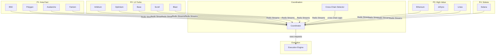

# Professional Multi-Chain Arbitrage System

A production-ready, institutional-grade arbitrage detection and execution system built with microservices architecture. Monitors 15 blockchains and 78 DEXs with <50ms detection latency at zero infrastructure cost.

## Key Metrics

- **Chains**: 15 (14 EVM + Solana) across 4 partitioned detectors
- **DEXs**: 78 (71 EVM + 7 Solana)
- **Latency**: <50ms detection (same-chain EVM), <100ms (Solana)
- **Scale**: 500+ opportunities/day
- **Cost**: $0 infrastructure (free-tier cloud providers)
- **Resilience**: 99.9% target uptime with auto-failover
- **Tests**: 438+ test files, ~13,475 test cases

---

## Documentation Hub

For detailed technical information, refer to the `docs/` folder:

### Architecture & Design
- [**System Architecture**](docs/architecture/ARCHITECTURE_V2.md): Comprehensive system design (v2.12)
- [**Data Flow**](docs/architecture/DATA_FLOW.md): Visual diagrams of data flow and processing pipelines
- [**Current State**](docs/architecture/CURRENT_STATE.md): Service inventory and partition mapping
- [**Architecture Decision Records**](docs/architecture/adr/README.md): 41 ADRs with rationale and confidence levels

### Developer Guides
- [**Local Development**](docs/local-development.md): Setup guide for Windows, macOS, and Linux
- [**Configuration**](docs/CONFIGURATION.md): All environment variables and config options
- [**Deployment Guide**](docs/deployment.md): Step-by-step setup for free-tier cloud providers
- [**Trading Strategies**](docs/strategies.md): Arbitrage logic and token selection methodology
- [**Code Conventions**](docs/agent/code_conventions.md): TypeScript best practices and patterns

### Testing & Quality
- [**Test Architecture**](docs/architecture/TEST_ARCHITECTURE.md): Testing strategy and patterns
- [**Manual Test Steps**](docs/MANUAL_TESTSTEPS.md): Manual testing procedures
- [**Integration Migration Guide**](docs/testing/integration-migration-guide.md): Test consolidation guide

### Operations & Security
- [**Monitoring Setup**](docs/operations/MONITORING_SETUP.md): Prometheus, Grafana, alerting
- [**Metrics Reference**](docs/operations/METRICS_REFERENCE.md): All 56 Prometheus metrics with PromQL examples
- [**Troubleshooting Guide**](docs/operations/TROUBLESHOOTING_PRODUCTION.md): Diagnostic decision trees for production issues
- [**Incident Response Runbook**](docs/operations/INCIDENT_RESPONSE_RUNBOOK.md): Severity levels, response procedures, recovery checklists
- [**Secrets Management**](docs/security/SECRETS_MANAGEMENT.md): Key rotation and security practices
- [**Auth Configuration**](docs/security/AUTH_CONFIGURATION.md): API keys, JWT, permissions, rate limiting
- [**Redis Stream Signing**](docs/security/REDIS_STREAM_SIGNING.md): HMAC setup, zero-downtime key rotation
- [**Redis Key Registry**](docs/redis-key-registry.md): All Redis key patterns and TTLs

### Reports & Research
- [**Profitability Audit**](docs/reports/PROFITABILITY_AUDIT_2026-02-24.md): Strategy economics and trade analysis
- [**Research Evaluation**](docs/research/CONSOLIDATED_RESEARCH_EVALUATION.md): Enhancement research findings
- [**Security Review**](contracts/docs/SECURITY_REVIEW.md): Contract security audit findings

---

## Architecture Overview

The system uses a partitioned microservices architecture with Redis Streams as the event backbone.


```mermaid
graph TB
    subgraph "P1: Asia-Fast"
        BSC[BSC]
        POLY[Polygon]
        AVAX[Avalanche]
        FTM[Fantom]
    end
    subgraph "P2: L2-Turbo"
        ARB[Arbitrum]
        OP[Optimism]
        BASE[Base]
        SCROLL[Scroll]
        BLAST[Blast]
    end
    subgraph "P3: High-Value"
        ETH[Ethereum]
        ZK[zkSync]
        LINEA[Linea]
    end
    subgraph "P4: Solana"
        SOL[Solana]
    end
    subgraph "Coordination"
        COORD[Coordinator]
        CC[Cross-Chain Detector]
    end
    subgraph "Execution"
        EE[Execution Engine]
    end

    BSC & POLY & AVAX & FTM -->|Redis Streams| COORD
    ARB & OP & BASE & SCROLL & BLAST -->|Redis Streams| COORD
    ETH & ZK & LINEA -->|Redis Streams| COORD
    SOL -->|Redis Streams| COORD
    COORD -->|exec-requests| EE
    CC -->|cross-chain opps| COORD
```

---

## Quick Start

### 1. Prerequisites
- Node.js >= 22.0.0
- npm >= 9.0.0
- Docker Desktop (optional, for Redis)

### 2. Installation
```bash
git clone <repository-url>
cd arbitrage_new
npm install
npm run dev:setup    # Copy .env.example to .env
```

### 3. Start Services
```bash
# Start Redis (choose one)
npm run dev:redis          # Docker (recommended)
npm run dev:redis:memory   # In-memory (no Docker)

# Start all services with hot reload
npm run dev:all

# OR minimal setup (Coordinator + P1 + Execution)
npm run dev:minimal
```

Visit **http://localhost:3000** for the coordinator dashboard.

---

## Supported Arbitrage Types

The system detects and executes multiple arbitrage strategies across chains and DEXes.

| Type | Description | Path Length | Status |
|------|-------------|-------------|--------|
| **Simple/Cross-DEX** | Same token pair across different DEXes | 2 | ACTIVE |
| **Triangular** | 3-token cycles (A→B→C→A) | 3 | ACTIVE |
| **Quadrilateral** | 4-token cycles (A→B→C→D→A) | 4 | ACTIVE |
| **Multi-Leg** | 5-7 token paths with DFS optimization | 5-7 | ACTIVE |
| **Cross-Chain** | Price differences across blockchains | 2+ | ACTIVE |
| **Whale-Triggered** | Signals from large transactions (>$50K) | N/A | ACTIVE |

All arbitrage types are detected in both **production** and **simulation** modes.

For detailed strategy documentation, see [Trading Strategies](docs/strategies.md).

---

## 🤝 Contributing
Please see the [Local Development Guide](docs/local-development.md) for setup instructions and the [Code Conventions](docs/agent/code_conventions.md) for coding standards.

## 📄 License
MIT License - see [LICENSE](LICENSE) for details.

## ⚠️ Disclaimer
Educational and research purposes only. Arbitrage trading involves significant financial risk.