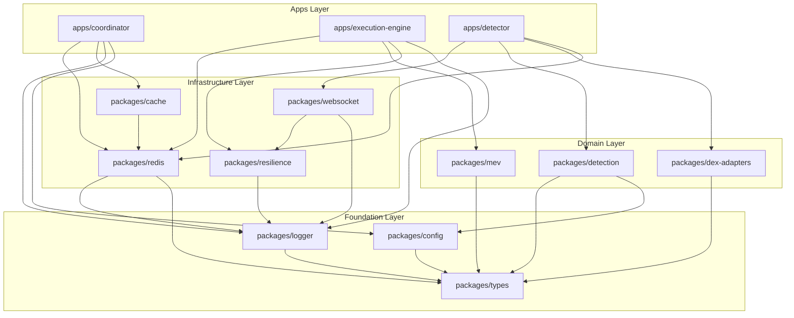

# Node.js Package Structure: Deep Dive Analysis & Migration Guide

**Date**: January 18, 2026  
**Goal**: Cleaner code, reduced complexity, and easy-to-follow data flow for debugging

---

## 1. Executive Summary

| Problem Identified | Root Cause | Solution |
|-------------------|------------|----------|
| **God Files** (2000+ lines) | Single file handling multiple responsibilities | Split by responsibility |
| **God Package** (`shared/core`: 78 files) | No domain boundaries | Domain-driven packages |
| **Circular Data Flow** | Services depend on shared, shared re-exports everything | Strict layered imports |
| **Hard to Debug** | Business logic mixed with infrastructure | Clean Architecture layers |

### Critical Files Requiring Immediate Attention

| File | Lines | Problem |
|------|-------|---------|
| `services/execution-engine/src/engine.ts` | **2,393** | Flash loans, MEV, queuing, health all in one |
| `services/coordinator/src/coordinator.ts` | **1,767** | HTTP, streams, metrics, leader election |
| `services/unified-detector/src/chain-instance.ts` | **1,763** | WebSocket, pairs, arbitrage, simulation |
| `shared/config/src/index.ts` | **1,793** | All chains, DEXs, tokens in one file |
| `shared/core/src/index.ts` | **789** | Re-exports 140+ symbols |

---

## 2. Target Architecture

### 2.1 Folder Structure

```
arbitrage-system/
├── apps/                              # Deployable microservices
│   ├── coordinator/
│   │   ├── src/
│   │   │   ├── api/                   # HTTP layer
│   │   │   │   ├── routes/
│   │   │   │   │   ├── health.routes.ts
│   │   │   │   │   ├── metrics.routes.ts
│   │   │   │   │   └── dashboard.routes.ts
│   │   │   │   ├── middleware/
│   │   │   │   │   └── auth.middleware.ts
│   │   │   │   └── server.ts
│   │   │   ├── consumers/             # Redis Streams consumers
│   │   │   │   ├── opportunity.consumer.ts
│   │   │   │   ├── health.consumer.ts
│   │   │   │   └── whale-alerts.consumer.ts
│   │   │   ├── services/              # Business logic
│   │   │   │   ├── metrics.service.ts
│   │   │   │   └── leader-election.service.ts
│   │   │   ├── config/
│   │   │   │   └── coordinator.config.ts
│   │   │   └── index.ts               # Composition root (DI)
│   │   ├── package.json
│   │   └── tsconfig.json
│   │
│   ├── execution-engine/
│   │   ├── src/
│   │   │   ├── consumers/
│   │   │   │   └── opportunity.consumer.ts
│   │   │   ├── services/
│   │   │   │   ├── queue.service.ts
│   │   │   │   ├── provider.service.ts
│   │   │   │   └── execution.service.ts
│   │   │   ├── strategies/            # Execution strategies
│   │   │   │   ├── flash-loan.strategy.ts
│   │   │   │   ├── mev-bundle.strategy.ts
│   │   │   │   └── standard.strategy.ts
│   │   │   ├── config/
│   │   │   │   └── engine.config.ts
│   │   │   └── index.ts
│   │   ├── package.json
│   │   └── tsconfig.json
│   │
│   └── detector/
│       ├── src/
│       │   ├── chains/                # Chain-specific logic
│       │   │   ├── evm/
│       │   │   │   ├── evm-chain.detector.ts
│       │   │   │   └── sync-event.parser.ts
│       │   │   └── solana/
│       │   │       ├── solana-chain.detector.ts
│       │   │       └── instruction.parser.ts
│       │   ├── simulation/
│       │   │   └── chain.simulator.ts
│       │   ├── services/
│       │   │   ├── unified-detector.service.ts
│       │   │   └── chain-manager.service.ts
│       │   └── index.ts
│       └── package.json
│
├── packages/                          # Shared libraries
│   ├── types/                         # Pure TypeScript types (NO runtime code)
│   │   ├── src/
│   │   │   ├── domain/
│   │   │   │   ├── opportunity.types.ts
│   │   │   │   ├── pair.types.ts
│   │   │   │   └── chain.types.ts
│   │   │   ├── infrastructure/
│   │   │   │   ├── redis.types.ts
│   │   │   │   └── provider.types.ts
│   │   │   └── index.ts
│   │   └── package.json
│   │
│   ├── config/                        # Configuration constants
│   │   ├── src/
│   │   │   ├── chains/
│   │   │   │   ├── arbitrum.config.ts
│   │   │   │   ├── bsc.config.ts
│   │   │   │   ├── base.config.ts
│   │   │   │   └── index.ts           # Re-exports CHAINS object
│   │   │   ├── dexes/
│   │   │   │   ├── uniswap.config.ts
│   │   │   │   ├── pancakeswap.config.ts
│   │   │   │   └── index.ts           # Re-exports DEXES object
│   │   │   ├── tokens/
│   │   │   │   └── index.ts
│   │   │   ├── event-signatures.ts
│   │   │   ├── thresholds.ts
│   │   │   └── index.ts
│   │   └── package.json
│   │
│   ├── logger/                        # Logging infrastructure
│   │   ├── src/
│   │   │   ├── logger.ts
│   │   │   ├── performance-logger.ts
│   │   │   └── index.ts
│   │   └── package.json
│   │
│   ├── redis/                         # Redis infrastructure
│   │   ├── src/
│   │   │   ├── client.ts
│   │   │   ├── streams.ts
│   │   │   ├── lock.ts
│   │   │   └── index.ts
│   │   └── package.json
│   │
│   ├── resilience/                    # Fault tolerance patterns
│   │   ├── src/
│   │   │   ├── circuit-breaker.ts
│   │   │   ├── retry.ts
│   │   │   ├── graceful-degradation.ts
│   │   │   ├── self-healing.ts
│   │   │   └── index.ts
│   │   └── package.json
│   │
│   ├── cache/                         # Caching infrastructure
│   │   ├── src/
│   │   │   ├── hierarchical-cache.ts
│   │   │   ├── shared-memory-cache.ts
│   │   │   ├── coherency-manager.ts
│   │   │   └── index.ts
│   │   └── package.json
│   │
│   ├── detection/                     # Arbitrage detection (PURE LOGIC)
│   │   ├── src/
│   │   │   ├── calculators/
│   │   │   │   ├── arbitrage.calculator.ts
│   │   │   │   └── price-impact.calculator.ts
│   │   │   ├── finders/
│   │   │   │   ├── triangular.finder.ts
│   │   │   │   ├── multi-leg.finder.ts
│   │   │   │   └── cross-dex.finder.ts
│   │   │   ├── filters/
│   │   │   │   └── swap-event.filter.ts
│   │   │   └── index.ts
│   │   └── package.json
│   │
│   ├── mev/                           # MEV protection strategies
│   │   ├── src/
│   │   │   ├── providers/
│   │   │   │   ├── flashbots.provider.ts
│   │   │   │   ├── l2-sequencer.provider.ts
│   │   │   │   └── standard.provider.ts
│   │   │   ├── factory.ts
│   │   │   └── index.ts
│   │   └── package.json
│   │
│   ├── dex-adapters/                  # DEX-specific adapters
│   │   ├── src/
│   │   │   ├── adapters/
│   │   │   │   ├── balancer-v2.adapter.ts
│   │   │   │   ├── gmx.adapter.ts
│   │   │   │   └── platypus.adapter.ts
│   │   │   ├── registry.ts
│   │   │   └── index.ts
│   │   └── package.json
│   │
│   └── websocket/                     # WebSocket management
│       ├── src/
│       │   ├── resilient-websocket.ts
│       │   ├── connection-pool.ts
│       │   └── index.ts
│       └── package.json
│
├── tools/                             # Build tooling
│   ├── eslint-config/
│   └── tsconfig/
│
├── package.json                       # Workspace root
├── pnpm-workspace.yaml
├── turbo.json
└── tsconfig.base.json
```

---

## 3. Class-to-Folder Mapping (Current → Target)

### 3.1 From `shared/core/src/` (78 files)

| Current Location | Target Package | Target Path |
|-----------------|----------------|-------------|
| `redis.ts` | `@arbitrage/redis` | `packages/redis/src/client.ts` |
| `redis-streams.ts` | `@arbitrage/redis` | `packages/redis/src/streams.ts` |
| `distributed-lock.ts` | `@arbitrage/redis` | `packages/redis/src/lock.ts` |
| `logger.ts` | `@arbitrage/logger` | `packages/logger/src/logger.ts` |
| `performance-logger.ts` (from service-state) | `@arbitrage/logger` | `packages/logger/src/performance-logger.ts` |
| `circuit-breaker.ts` | `@arbitrage/resilience` | `packages/resilience/src/circuit-breaker.ts` |
| `retry-mechanism.ts` | `@arbitrage/resilience` | `packages/resilience/src/retry.ts` |
| `graceful-degradation.ts` | `@arbitrage/resilience` | `packages/resilience/src/graceful-degradation.ts` |
| `self-healing-manager.ts` | `@arbitrage/resilience` | `packages/resilience/src/self-healing.ts` |
| `expert-self-healing-manager.ts` | `@arbitrage/resilience` | `packages/resilience/src/expert-self-healing.ts` |
| `error-recovery.ts` | `@arbitrage/resilience` | `packages/resilience/src/error-recovery.ts` |
| `hierarchical-cache.ts` | `@arbitrage/cache` | `packages/cache/src/hierarchical-cache.ts` |
| `shared-memory-cache.ts` | `@arbitrage/cache` | `packages/cache/src/shared-memory-cache.ts` |
| `cache-coherency-manager.ts` | `@arbitrage/cache` | `packages/cache/src/coherency-manager.ts` |
| `gas-price-cache.ts` | `@arbitrage/cache` | `packages/cache/src/gas-price.cache.ts` |
| `pair-cache.ts` | `@arbitrage/cache` | `packages/cache/src/pair.cache.ts` |
| `cross-dex-triangular-arbitrage.ts` | `@arbitrage/detection` | `packages/detection/src/finders/triangular.finder.ts` |
| `multi-leg-path-finder.ts` | `@arbitrage/detection` | `packages/detection/src/finders/multi-leg.finder.ts` |
| `arbitrage-calculator.ts` | `@arbitrage/detection` | `packages/detection/src/calculators/arbitrage.calculator.ts` |
| `liquidity-depth-analyzer.ts` | `@arbitrage/detection` | `packages/detection/src/calculators/liquidity-depth.analyzer.ts` |
| `price-matrix.ts` | `@arbitrage/detection` | `packages/detection/src/calculators/price-matrix.ts` |
| `price-momentum.ts` | `@arbitrage/detection` | `packages/detection/src/calculators/price-momentum.ts` |
| `swap-event-filter.ts` | `@arbitrage/detection` | `packages/detection/src/filters/swap-event.filter.ts` |
| `whale-activity-tracker.ts` | `@arbitrage/detection` | `packages/detection/src/trackers/whale-activity.tracker.ts` |
| `mev-protection/` (entire folder) | `@arbitrage/mev` | `packages/mev/src/` |
| `dex-adapters/` (entire folder) | `@arbitrage/dex-adapters` | `packages/dex-adapters/src/` |
| `websocket-manager.ts` | `@arbitrage/websocket` | `packages/websocket/src/resilient-websocket.ts` |
| `async-utils.ts` | `@arbitrage/utils` | `packages/utils/src/async.ts` |
| `validation.ts` | `@arbitrage/utils` | `packages/utils/src/validation.ts` |
| `error-handling.ts` | `@arbitrage/utils` | `packages/utils/src/error-handling.ts` |
| `solana-detector.ts` | `apps/detector` | `apps/detector/src/chains/solana/solana-chain.detector.ts` |
| `solana-price-feed.ts` | `apps/detector` | `apps/detector/src/chains/solana/price-feed.ts` |
| `solana-swap-parser.ts` | `apps/detector` | `apps/detector/src/chains/solana/instruction.parser.ts` |

### 3.2 From `shared/config/src/index.ts` (1793 lines → multiple files)

| Current Section | Target File |
|-----------------|-------------|
| `CHAINS` object (lines 18-230) | `packages/config/src/chains/index.ts` |
| Individual chain configs | `packages/config/src/chains/{chain}.config.ts` |
| `DEXES` object (lines 236-700) | `packages/config/src/dexes/index.ts` |
| `TOKEN_METADATA` object | `packages/config/src/tokens/index.ts` |
| `EVENT_SIGNATURES` | `packages/config/src/event-signatures.ts` |
| `ARBITRAGE_CONFIG`, thresholds | `packages/config/src/thresholds.ts` |

### 3.3 Splitting God Files in Services

#### `coordinator.ts` (1767 lines → 7 files)

| Responsibility | Target File |
|---------------|-------------|
| Express server setup | `apps/coordinator/src/api/server.ts` |
| Health routes | `apps/coordinator/src/api/routes/health.routes.ts` |
| Metrics routes | `apps/coordinator/src/api/routes/metrics.routes.ts` |
| Dashboard routes | `apps/coordinator/src/api/routes/dashboard.routes.ts` |
| Stream consumption | `apps/coordinator/src/consumers/opportunity.consumer.ts` |
| Leader election | `apps/coordinator/src/services/leader-election.service.ts` |
| Metrics aggregation | `apps/coordinator/src/services/metrics.service.ts` |
| Composition (DI wiring) | `apps/coordinator/src/index.ts` |

#### `engine.ts` (2393 lines → 8 files)

| Responsibility | Target File |
|---------------|-------------|
| Queue management | `apps/execution-engine/src/services/queue.service.ts` |
| Provider management | `apps/execution-engine/src/services/provider.service.ts` |
| Core execution loop | `apps/execution-engine/src/services/execution.service.ts` |
| Flash loan strategy | `apps/execution-engine/src/strategies/flash-loan.strategy.ts` |
| MEV bundle strategy | `apps/execution-engine/src/strategies/mev-bundle.strategy.ts` |
| Standard execution | `apps/execution-engine/src/strategies/standard.strategy.ts` |
| Stream consumption | `apps/execution-engine/src/consumers/opportunity.consumer.ts` |
| Composition (DI wiring) | `apps/execution-engine/src/index.ts` |

#### `chain-instance.ts` (1763 lines → 6 files)

| Responsibility | Target File |
|---------------|-------------|
| EVM chain detection | `apps/detector/src/chains/evm/evm-chain.detector.ts` |
| Sync event parsing | `apps/detector/src/chains/evm/sync-event.parser.ts` |
| WebSocket subscriptions | `apps/detector/src/chains/evm/subscription.manager.ts` |
| Pair initialization | `apps/detector/src/services/pair.service.ts` |
| Simulation mode | `apps/detector/src/simulation/chain.simulator.ts` |
| Unified orchestration | `apps/detector/src/services/chain-manager.service.ts` |

---

## 4. Data Flow Design (For Easy Debugging)

### 4.1 Layered Architecture Per Service

```
┌─────────────────────────────────────────────────────────────────┐
│                       apps/coordinator                          │
├─────────────────────────────────────────────────────────────────┤
│  ┌─────────────────┐   ┌─────────────────┐   ┌───────────────┐ │
│  │   api/routes/   │ → │   services/     │ → │  consumers/   │ │
│  │                 │   │                 │   │               │ │
│  │ health.routes   │   │ metrics.service │   │ opportunity   │ │
│  │ metrics.routes  │   │ leader-election │   │ health        │ │
│  └─────────────────┘   └─────────────────┘   └───────────────┘ │
│           │                     │                     │         │
│           └─────────────────────┼─────────────────────┘         │
│                                 ▼                               │
│                    ┌─────────────────────┐                      │
│                    │      index.ts       │                      │
│                    │  (Composition Root) │                      │
│                    │   - Wires up DI     │                      │
│                    │   - Starts service  │                      │
│                    └─────────────────────┘                      │
└─────────────────────────────────────────────────────────────────┘
                                 │
                                 ▼
┌─────────────────────────────────────────────────────────────────┐
│                         packages/                               │
│                                                                 │
│  ┌──────────┐ ┌──────────┐ ┌────────────┐ ┌──────────────────┐ │
│  │  redis   │ │  logger  │ │ resilience │ │    detection     │ │
│  │          │ │          │ │            │ │                  │ │
│  │ client   │ │ logger   │ │ circuit-   │ │ triangular.finder│ │
│  │ streams  │ │ perf-log │ │ breaker    │ │ multi-leg.finder │ │
│  │ lock     │ │          │ │ retry      │ │ arbitrage.calc   │ │
│  └──────────┘ └──────────┘ └────────────┘ └──────────────────┘ │
└─────────────────────────────────────────────────────────────────┘
```

### 4.2 Dependency Rule (Strict)

```
┌─────────────────────────────────────────────────────────────┐
│                    DEPENDENCY DIRECTION                      │
│                                                             │
│   apps/  ──────────────────────────────────────────►        │
│          imports from packages/, never the reverse          │
│                                                             │
│   packages/detection  ──────────────────────────────►       │
│          imports from packages/types, packages/config       │
│          NEVER imports from packages/redis                  │
│                                                             │
│   packages/redis  ────────────────────────────────►         │
│          imports from packages/types only                   │
│                                                             │
│   packages/types  ────────────────────────────────►         │
│          imports from NOTHING (pure types)                  │
│                                                             │
└─────────────────────────────────────────────────────────────┘
```

### 4.3 Import Path Examples

```typescript
// ❌ BEFORE: Opaque, everything from core
import { 
  RedisClient, 
  CrossDexTriangularArbitrage, 
  createLogger,
  CircuitBreaker 
} from '@arbitrage/core';

// ✅ AFTER: Explicit, understandable imports
import { RedisClient, RedisStreamsClient } from '@arbitrage/redis';
import { TriangularFinder } from '@arbitrage/detection';
import { createLogger } from '@arbitrage/logger';
import { CircuitBreaker } from '@arbitrage/resilience';
```

---

## 5. Detailed Migration Plan

### Phase 1: Foundation (Week 1) — No Breaking Changes

| Step | Task | Files Changed | Risk |
|------|------|---------------|------|
| 1.1 | Install pnpm, create `pnpm-workspace.yaml` | Root config | Low |
| 1.2 | Add Turborepo config (`turbo.json`) | Root config | Low |
| 1.3 | Create `tsconfig.base.json` with project references | Root config | Low |
| 1.4 | Create `packages/types` (extract from `shared/types`) | New package | Low |
| 1.5 | Create `packages/logger` (extract `logger.ts`) | New package | Low |

#### Step 1.4 Detail: Extract `packages/types`

```bash
mkdir -p packages/types/src/domain packages/types/src/infrastructure
```

Move and split types:
- `shared/types/index.ts` → `packages/types/src/index.ts` (re-exports)
- Create `packages/types/src/domain/opportunity.types.ts`:
  ```typescript
  export interface ArbitrageOpportunity {
    id: string;
    chain: string;
    buyDex: string;
    sellDex: string;
    tokenPair: string;
    profitPercentage: number;
    estimatedProfit: number;
    timestamp: number;
    expiresAt: number;
  }
  ```

#### Step 1.5 Detail: Extract `packages/logger`

```bash
mkdir -p packages/logger/src
```

Contents of `packages/logger/src/logger.ts`:
```typescript
// Pure logging, no Redis, no external deps
export interface LoggerOptions {
  service: string;
  level?: 'debug' | 'info' | 'warn' | 'error';
}

export function createLogger(options: LoggerOptions) { ... }
```

---

### Phase 2: Infrastructure Packages (Week 2)

| Step | Task | Dependencies |
|------|------|--------------|
| 2.1 | Create `packages/redis` | `@arbitrage/types`, `@arbitrage/logger` |
| 2.2 | Create `packages/resilience` | `@arbitrage/types`, `@arbitrage/logger` |
| 2.3 | Create `packages/cache` | `@arbitrage/redis`, `@arbitrage/logger` |
| 2.4 | Create `packages/websocket` | `@arbitrage/logger`, `@arbitrage/resilience` |

#### Step 2.1 Detail: Extract `packages/redis`

Files to create:
- `packages/redis/src/client.ts` ← from `shared/core/src/redis.ts`
- `packages/redis/src/streams.ts` ← from `shared/core/src/redis-streams.ts`
- `packages/redis/src/lock.ts` ← from `shared/core/src/distributed-lock.ts`
- `packages/redis/src/index.ts` ← public API

`packages/redis/package.json`:
```json
{
  "name": "@arbitrage/redis",
  "version": "1.0.0",
  "main": "./dist/index.js",
  "types": "./dist/index.d.ts",
  "exports": {
    ".": "./dist/index.js",
    "./streams": "./dist/streams.js",
    "./lock": "./dist/lock.js"
  },
  "dependencies": {
    "ioredis": "^5.0.0"
  },
  "peerDependencies": {
    "@arbitrage/types": "workspace:*",
    "@arbitrage/logger": "workspace:*"
  }
}
```

---

### Phase 3: Domain Packages (Week 3)

| Step | Task | Dependencies |
|------|------|--------------|
| 3.1 | Create `packages/config` (split 1793-line file) | `@arbitrage/types` |
| 3.2 | Create `packages/detection` | `@arbitrage/types`, `@arbitrage/config` |
| 3.3 | Create `packages/mev` | `@arbitrage/types`, `@arbitrage/logger` |
| 3.4 | Create `packages/dex-adapters` | `@arbitrage/types`, `@arbitrage/config` |

#### Step 3.1 Detail: Split `shared/config/src/index.ts`

```bash
mkdir -p packages/config/src/{chains,dexes,tokens}
```

Create `packages/config/src/chains/arbitrum.config.ts`:
```typescript
import { Chain } from '@arbitrage/types';

export const ARBITRUM: Chain = {
  id: 42161,
  name: 'Arbitrum',
  rpcUrl: process.env.ARBITRUM_RPC_URL || 'https://arb1.arbitrum.io/rpc',
  wsUrl: process.env.ARBITRUM_WS_URL || 'wss://arb1.arbitrum.io/rpc',
  // ... rest of config
};
```

Create `packages/config/src/chains/index.ts`:
```typescript
import { ARBITRUM } from './arbitrum.config';
import { BSC } from './bsc.config';
import { BASE } from './base.config';
// ...

export const CHAINS = {
  arbitrum: ARBITRUM,
  bsc: BSC,
  base: BASE,
  // ...
} as const;
```

#### Step 3.2 Detail: Extract `packages/detection`

> [!IMPORTANT]
> This package must be **PURE LOGIC** with no I/O dependencies. It should only depend on `@arbitrage/types` and `@arbitrage/config`.

```bash
mkdir -p packages/detection/src/{calculators,finders,filters,trackers}
```

Move files:
- `cross-dex-triangular-arbitrage.ts` → `finders/triangular.finder.ts`
- `multi-leg-path-finder.ts` → `finders/multi-leg.finder.ts`
- `arbitrage-calculator.ts` → `calculators/arbitrage.calculator.ts`

---

### Phase 4: Service Decomposition (Week 4-5)

| Step | Task | God File Split |
|------|------|----------------|
| 4.1 | Split `coordinator.ts` | 1767 lines → 7 files |
| 4.2 | Split `engine.ts` | 2393 lines → 8 files |
| 4.3 | Split `chain-instance.ts` | 1763 lines → 6 files |

#### Step 4.1 Detail: Split `coordinator.ts`

1. **Create `apps/coordinator/src/api/routes/health.routes.ts`**:
   ```typescript
   import { Router } from 'express';
   import { MetricsService } from '../../services/metrics.service';

   export function createHealthRoutes(metrics: MetricsService): Router {
     const router = Router();
     
     router.get('/health', (req, res) => {
       const health = metrics.getSystemHealth();
       res.json(health);
     });
     
     return router;
   }
   ```

2. **Create `apps/coordinator/src/services/leader-election.service.ts`**:
   ```typescript
   import { DistributedLockManager } from '@arbitrage/redis';
   import { Logger } from '@arbitrage/logger';

   export class LeaderElectionService {
     private isLeader = false;
     private heartbeatInterval: NodeJS.Timeout | null = null;

     constructor(
       private lockManager: DistributedLockManager,
       private logger: Logger,
       private config: LeaderElectionConfig
     ) {}

     async tryAcquireLeadership(): Promise<boolean> { ... }
     async releaseLeadership(): Promise<void> { ... }
   }
   ```

3. **Update `apps/coordinator/src/index.ts`** (Composition Root):
   ```typescript
   import { RedisClient, RedisStreamsClient } from '@arbitrage/redis';
   import { createLogger } from '@arbitrage/logger';
   import { createHealthRoutes } from './api/routes/health.routes';
   import { LeaderElectionService } from './services/leader-election.service';
   import { MetricsService } from './services/metrics.service';
   import { OpportunityConsumer } from './consumers/opportunity.consumer';

   async function main() {
     // 1. Create infrastructure
     const redis = new RedisClient();
     const streams = new RedisStreamsClient(redis);
     const logger = createLogger({ service: 'coordinator' });

     // 2. Create services
     const metrics = new MetricsService(logger);
     const leaderElection = new LeaderElectionService(redis, logger, config);

     // 3. Create consumers
     const opportunityConsumer = new OpportunityConsumer(streams, metrics, logger);

     // 4. Create HTTP server with routes
     const app = express();
     app.use('/api', createHealthRoutes(metrics));

     // 5. Start everything
     await redis.connect();
     await opportunityConsumer.start();
     app.listen(3000);
   }

   main().catch(console.error);
   ```

---

### Phase 5: Validation (Week 6)

| Task | Command | Expected Result |
|------|---------|-----------------|
| Build all packages | `pnpm turbo build` | All packages compile |
| Run unit tests | `pnpm turbo test` | 80%+ coverage |
| Check circular deps | `pnpm exec madge --circular packages/` | 0 circular dependencies |
| Verify build cache | `pnpm turbo build` (2nd run) | < 5 seconds (cached) |
| Integration test | `pnpm run test:integration` | All green |

---

## 6. Package Dependencies Graph



---

## 7. File Size Limits (Enforced by ESLint)

```javascript
// tools/eslint-config/rules/file-size.js
module.exports = {
  rules: {
    'max-lines': ['error', {
      max: 400,
      skipBlankLines: true,
      skipComments: true
    }],
    'max-lines-per-function': ['warn', {
      max: 50,
      skipBlankLines: true,
      skipComments: true
    }]
  }
};
```

---

## 8. Success Metrics

| Metric | Current Value | Target Value |
|--------|---------------|--------------|
| Max file size | 2,393 lines | < 400 lines |
| `shared/core` exports | 140+ | 0 (package deleted) |
| Package count | 3 (`core`, `config`, `types`) | 12-15 focused packages |
| Circular dependencies | Unknown | 0 |
| Build time (cold) | ~90s | < 60s |
| Build time (cached) | ~90s | < 5s |

---

## 9. References

- [Node.js Package Entry Points](https://nodejs.org/api/packages.html#package-entry-points)
- [Turborepo Handbook](https://turbo.build/repo/docs/handbook)
- [pnpm Workspaces](https://pnpm.io/workspaces)
- [Clean Architecture in Node.js](https://blog.cleancoder.com/uncle-bob/2012/08/13/the-clean-architecture.html)
